# Structured Workflow MCP Server

[](https://coff.ee/jasonholtdigital)
[](https://smithery.ai/server/@kingdomseed/structured-workflow-mcp)

An MCP server that enforces disciplined programming practices by requiring AI assistants to audit their work and produce verified outputs at each phase of development.

## Why I Built This

**TLDR**: I got tired of repeating "inventory and audit first" across every AI platform and prompt, so I built an MCP server that automatically enforces this disciplined approach. It forces AI to think systematically and follow structured phases instead of jumping straight into code changes. 

So I've built an MCP server that fits into my workflow and thinking process while I'm programming. I made it available via npx and you can download it yourself if you want something local. 

In essence I was doing some repeated tasks with AI where I wanted it to complete refactoring work for part of a larger project. I was struggling because it was often missing or glossing over key things: classes or systems that already exist (a preferences service for example), creating duplicates of things, or when correcting mistakes, leaving orphaned unused methods/code around places, and when writing tests it would often pull in the wrong imports or put these together in the wrong way resulting in syntax errors but would jump straight into writing the next test without fixing the first one that was broken.

I sort of stumbled on this idea of the model needing to perform an audit and inventory of the current project (or not even the whole project--just one layer or feature in a project) before moving to any kind of implementation phase and it needed a lint iterate lint phase. I tried this with rules with limited success and then prompting with much better success but I was constantly repeating myself. 

So I started noodling on this idea of an MCP server that forced the AI to work through a problem in phases or lanes. So that's what this does. There's a number of different workflow styles and I'm open to any other ideas or improvements.

Feel free to check it out if it helps your use case. It's a work in progress but it has been doing a pretty great job for what I'm using it for now. Happy to share more if you are interested.

## Features

**Enforced Workflow Phases** - AI must complete specific phases in order (setup, audit, analysis, planning, implementation, testing, etc.)

**Mandatory Output Artifacts** - Each phase requires structured documentation or verified outputs before proceeding

**Multiple Workflow Types**:
- Refactor workflows for code improvement  
- Feature development with integrated testing
- Test-focused workflows for coverage improvement
- Test-driven development (TDD) cycles
- Custom workflows for specialized needs

**Output Verification** - The server validates that outputs contain meaningful content and proper structure

**Session State Management** - Tracks progress and prevents skipping phases

## How It Works

Here's how the AI moves through a structured workflow:

```mermaid
graph TD
    A[🚀 Start Workflow] --> B[AI Gets Phase Guidance]
    B --> C{Create Phase Output}
    C --> D[Auto-Save with Numbered Naming<br/>00-setup-confirmation-2025-01-07.md]
    D --> E[Phase Validation]
    E --> F{All Phases Done?}
    F -->|No| G[Move to Next Phase]
    G --> B
    F -->|Yes| H[Workflow Complete!]
    
    style A fill:#e1f5fe
    style B fill:#f3e5f5
    style C fill:#fff3e0
    style D fill:#e8f5e8
    style E fill:#fff9c4
    style H fill:#e8f5e8
```



**What happens at each step:**
1. **Start Workflow** - AI calls a workflow tool (refactor_workflow, create_feature_workflow, etc.)
2. **AI Gets Phase Guidance** - Server provides specific instructions for current phase (audit, analyze, implement, etc.)
3. **Create Phase Output** - AI works through the phase and creates documentation/artifacts
4. **Auto-Save** - Files are automatically saved with numbered naming in task directories
5. **Phase Validation** - Server validates outputs meet requirements before proceeding
6. **Next Phase** - Process repeats until workflow is complete

One benefit of this breakdown is that the AI agent receive instruction sets that are relevant to the current phase and not the entire workflow. This can help prevent the AI from getting lost in the weeds of the entire workflow and instead focus on the current phase. An interesting article on this can be read here: [LLMs Get Lost In Multi-Turn Conversation](https://arxiv.org/abs/2505.06120v1)

## Workflow Output

### AI-Generated Documentation

The server **suggests** numbered workflow files as you progress through phases. The AI assistant handles the actual file creation using its own tools:

```
workflows/
├── your-task-name/
│   ├── 01-audit-inventory-2025-01-04.md
│   ├── 02-compare-analyze-2025-01-04.json
│   ├── 03-question-determine-2025-01-04.md
│   ├── 04-write-or-refactor-2025-01-04.md
│   ├── 05-test-2025-01-04.json
│   ├── 06-lint-2025-01-04.json
│   ├── 07-iterate-2025-01-04.md
│   └── 08-present-2025-01-04.md
```

### Workflow Architecture

**File Handling**: The server provides suggested paths and formats but does not directly write files. Instead, it instructs the AI assistant to create these files using its own file system access.

**Consistent Naming**: Files follow a standardized naming convention with phase numbers, names, and timestamps.

**Environment Independence**: The architecture works across any environment where the AI has appropriate file system permissions.

**Graceful Degradation**: If the AI is unable to create files, the workflow continues in memory-only mode - your progress isn't interrupted.

## Installation

### Quick Start (Recommended) - Zero Installation

**Add to your AI assistant config** - Uses npx automatically:

> 💡 **Note**: I recommend using `@latest` to ensure you always get the newest features and fixes. Without `@latest`, npx may cache older versions.

**VS Code / Cursor / Windsurf** - Add to your MCP settings:
```json
{
  "mcp": {
    "servers": {
      "structured-workflow": {
        "command": "npx",
        "args": ["structured-workflow-mcp@latest"],
        "env": {}
      }
    }
  }
}
```


**Claude Desktop** - Add to your `claude_desktop_config.json`:
```json
{
  "mcpServers": {
    "structured-workflow": {
      "command": "npx",
      "args": ["structured-workflow-mcp@latest"],
      "env": {}
    }
  }
}
```


### Global Installation (Optional)

You can install globally on your machine using NPM:

```bash
npm install -g structured-workflow-mcp
```

Then use in your AI assistant config:
```json
{
  "mcp": {
    "servers": {
      "structured-workflow": {
        "command": "structured-workflow-mcp",
        "args": [],
        "env": {}
      }
    }
  }
}
```

**With custom output directory**:
```json
{
  "mcp": {
    "servers": {
      "structured-workflow": {
        "command": "structured-workflow-mcp",
        "args": ["--output-dir", "/home/user/workflow-outputs"],
        "env": {}
      }
    }
  }
}
```

### Auto-Install via Smithery

Smithery provides a number of ways to install directly into your apps including this way for Claude Desktop:

```bash
npx -y @smithery/cli install structured-workflow-mcp --client claude
```

### Manual Installation

For developers, you can clone the repository and build it locally:

```bash
git clone https://github.com/kingdomseed/structured-workflow-mcp
cd structured-workflow-mcp
npm install && npm run build
```

## Usage

Once configured in your AI assistant, start with these workflow tools:

- `mcp__structured-workflow__build_custom_workflow` - Create custom workflows 
- `mcp__structured-workflow__refactor_workflow` - Structured refactoring
- `mcp__structured-workflow__create_feature_workflow` - Feature development
- `mcp__structured-workflow__test_workflow` - Test coverage workflows

## Example Output Artifacts

The server enforces that AI produces structured outputs like these:

**AUDIT_INVENTORY Phase Output:**
```json
{
  "filesAnalyzed": ["lib/auth/user_service.dart", "lib/auth/auth_middleware.dart"],
  "dependencies": {
    "providers": ["userProvider", "authStateProvider"],
    "models": ["User", "AuthToken"]
  },
  "issues": [
    "Single Responsibility Principle violation - handles too many concerns",
    "File approaching 366 lines - recommended to keep widgets smaller"
  ],
  "changesList": [
    {
      "action": "CREATE",
      "file": "lib/auth/components/auth_form.dart",
      "description": "Extract authentication form logic",
      "justification": "Component focused on form validation only"
    }
  ]
}
```

**COMPARE_ANALYZE Phase Output:**
```json
{
  "approaches": [
    {
      "name": "Incremental Component Extraction",
      "complexity": "Medium",
      "risk": "Low", 
      "timeEstimate": "30-45 minutes"
    }
  ],
  "recommendation": "Incremental Component Extraction",
  "justification": "Provides best balance of benefits vs. risk",
  "selectedImplementationOrder": [
    "1. Extract form component (lowest risk)",
    "2. Create validation service",
    "3. Refactor main view"
  ]
}
```

Each phase requires documented analysis and planning before the AI can proceed to implementation.

## Tools

### Workflow Entry Points

**refactor_workflow** - Start a structured refactoring process with required analysis and planning phases

**create_feature_workflow** - Develop new features with integrated testing and documentation requirements  

**test_workflow** - Add test coverage with mandatory analysis of what needs testing

**tdd_workflow** - Implement Test-Driven Development with enforced Red-Green-Refactor cycles

**build_custom_workflow** - Create workflows with custom phases and validation requirements

### Phase Guidance Tools

- **audit_inventory_guidance** - Forces thorough code analysis and change cataloging

- **compare_analyze_guidance** - Requires evaluation of multiple approaches with pros/cons

- **question_determine_guidance** - Mandates clarification and finalized planning

- **phase_output** - Validates and records structured outputs from each phase

- **workflow_status** - Check current progress and validation state

## Usage

The server enforces structured workflows through mandatory phases. Each workflow type has different phase requirements:

- **Refactor Workflow**: AUDIT_INVENTORY → COMPARE_ANALYZE → QUESTION_DETERMINE → WRITE_OR_REFACTOR → LINT → ITERATE → PRESENT

- **Feature Workflow**: PLANNING → QUESTION_DETERMINE → WRITE_OR_REFACTOR → TEST → LINT → ITERATE → PRESENT  

- **Test Workflow**: AUDIT_INVENTORY → QUESTION_DETERMINE → WRITE_OR_REFACTOR → TEST → ITERATE → PRESENT

- **TDD Workflow**: PLANNING → WRITE_OR_REFACTOR → TEST → (Red-Green-Refactor cycles) → LINT → PRESENT

### Input Validation

The server requires:
- `task` (string): Description of what you want to accomplish
- `outputArtifacts` (array): Structured documentation for each completed phase

### Output Validation

Each phase completion is validated for:
- Meaningful content length (minimum 10 characters)
- Valid JSON format for structured outputs
- Phase-specific content requirements
- Proper documentation of decisions and analysis

### Safety Rule

Files must be read before modification. This prevents accidental data loss and ensures informed changes.

## Development

```bash
npm run dev      # TypeScript compiler in watch mode  
npm run lint     # Run linter
npm run typecheck # Type checking
npm test         # Run tests
```

## How It Works

1. AI starts a workflow using one of the entry point tools
2. Server creates a session and tracks phase progression  
3. Each phase requires specific outputs before proceeding
4. The `phase_output` tool validates artifacts have meaningful content
5. AI cannot skip phases or claim completion without verified outputs
6. Session state prevents circumventing the structured approach

## Testing the MCP Server

You can quickly try out the Structured Workflow MCP server using the test prompts and helper scripts included in this repository.

1. Build the server (if you haven't already):
   ```bash
   npm run build
   ```
2. Start the server:
   ```bash
   node dist/index.js
   ```
3. Open the test prompt [`docs/test_prompt/mcp_server_test_prompt.md`](docs/test_prompt/mcp_server_test_prompt.md) in your preferred MCP-compatible AI client and paste the contents.
4. Alternatively, open the sample project located in [`refactor-test/`](refactor-test) for an end-to-end refactor workflow demo. Follow the steps in its `README.md` to run and observe the structured workflow in action.
5. Watch the AI progress through each phase and verify the structured outputs produced.

## Sample Prompts

The [`docs/sample_prompts`](docs/sample_prompts) directory contains several ready-to-use prompts illustrating typical workflows:

- `feature_workflow_prompt.md`
- `refactor_workflow_prompt.md`
- `test_workflow_prompt.md`
- `tdd_workflow_prompt.md`
- `custom_workflow_prompt.md`

Use these as a starting point and adapt them to your projects.

## Building

```bash
npm install
npm run build
```

The server uses TypeScript with the @modelcontextprotocol/sdk and runs locally via stdio transport.

## Pull Requests Welcome

I welcome and encourage pull requests! Whether you're fixing bugs, adding features, or improving documentation, your contributions are valuable.

Please follow these steps:

1. Fork the repository on GitHub.
2. Create a new branch: `git checkout -b feature/your-feature`.
3. Make your changes and commit with clear, descriptive messages.
4. Write tests for any new functionality and ensure all existing tests pass.
5. Push to your branch: `git push origin feature/your-feature`.
6. Open a pull request and describe your changes clearly.

See [CONTRIBUTING.md](CONTRIBUTING.md) for more details, if available.  

Thank you for contributing!

## License

This MCP server is licensed under the MIT License. This means you are free to use, modify, and distribute the software, subject to the terms and conditions of the MIT License.