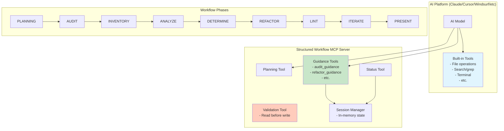

# Structured Workflow MCP Server - Design Document v0.2.7

## Executive Summary

The Structured Workflow MCP Server is a **guidance-based system** that helps AI coding assistants follow professional development practices through intelligent phase-based workflows. This TypeScript-based local MCP server adds specialized workflow tools to an AI's existing toolset, providing contextual guidance without restricting access to any tools.

### Purpose and Goal

**Purpose**: To enhance AI coding assistants with structured workflow guidance tools that promote professional refactoring practices while maintaining the AI's autonomy and full access to all its capabilities.

**Goal**: Create a set of MCP tools that teach AI models to follow a disciplined refactoring workflow (PLANNING → AUDIT → INVENTORY → COMPARE/ANALYZE → QUESTION → DETERMINE/PLAN → WRITE/REFACTOR → LINT → ITERATE → PRESENT) through intelligent guidance rather than restrictions.

### Core Philosophy: A Disciplined Approach to Programming

- **All tools remain available** - The AI keeps access to all its built-in tools and any MCP tools
- **Intelligent guidance** - Our tools provide phase-specific instructions and recommendations
- **Platform-agnostic** - Works with any AI that supports MCP (Claude, Cursor, Windsurf, etc.)
- **Planning-first** - Helps AI understand the entire workflow before beginning
- **Local-only** - Simple stdio transport, no remote servers or authentication needed
- **Session-based** - In-memory state management for the duration of a refactoring session

## Technology Stack

- **Language**: TypeScript
- **SDK**: @modelcontextprotocol/sdk
- **Transport**: stdio (local only - no remote server support)
- **State Management**: In-memory session state (no persistence)
- **Testing**: MCP Inspector for basic validation

## Architecture Overview

### What Makes This Different

Traditional approach to workflow enforcement:
- ❌ Hide tools in certain phases
- ❌ Block access to capabilities
- ❌ Force specific tool usage
- ❌ Complex state management

Our approach:
- ✅ Add helpful guidance tools
- ✅ Provide phase-specific instructions
- ✅ Let AI choose best tools for the job
- ✅ Simple session-based tracking

This is not about controlling the AI - it's about giving it better tools to organize its work.

When you connect this MCP server:
1. The AI retains all its built-in tools (file editing, searching, terminal, etc.)
2. Our MCP server adds workflow-specific tools (plan_workflow, audit_guidance, etc.)
3. The AI can use ANY tool at ANY time - both built-in and MCP tools
4. Our guidance tools help the AI choose appropriate tools for each workflow phase

**Key Principle**: We don't need to know the specific names of the AI's built-in tools. Our guidance describes the *types* of actions needed (e.g., "read files", "search for patterns", "edit code"), and the AI uses its best available tools to accomplish these tasks.

### System Components



**Key Points:**
- AI has full access to both built-in tools and MCP tools
- MCP server adds specialized workflow tools
- Session state is maintained in memory
- Only one enforced rule: read before write

### Key Design Principles

1. **MCP Tools Are Additive**: This server adds specialized workflow tools to whatever tools the AI already has. We don't replace or hide existing capabilities.

2. **Guidance Through Instructions**: Each tool provides clear instructions about what to do, not which specific tools to use. The AI chooses the best tools from its full toolkit.

3. **Tool-Name Agnostic**: We never specify tool names like "edit_file" or "codebase_search" because these vary by platform. Instead, we describe actions like "read files" or "search for patterns."

4. **Session-Based Simplicity**: All state is temporary and session-based. When the MCP connection ends, the session ends. No complexity from persistence or state recovery.

5. **One Safety Rule**: The only enforced rule is reading files before modifying them. Everything else is guidance that the AI can adapt to its situation.

6. **Local-Only Design**: Using stdio transport keeps things simple. No authentication, no remote connections, no security complexity.

## Core Tools Implementation

### 1. Workflow Planning Tool

The planning tool is the **primary entry point** that helps the AI understand the entire workflow before beginning:

```typescript
{
  name: 'plan_workflow',
  description: 'Create a comprehensive plan for your refactoring task using the structured workflow phases',
  parameters: {
    task: {
      type: 'string',
      description: 'Description of the refactoring task'
    },
    context: {
      type: 'object',
      description: 'Additional context (optional)',
      properties: {
        targetFiles: { type: 'array', items: { type: 'string' } },
        scope: { type: 'string', enum: ['file', 'directory', 'project'] },
        constraints: { type: 'array', items: { type: 'string' } }
      }
    }
  },
  handler: async (params, context) => {
    // Discover all available tools
    const allTools = await context.discoverAllTools();
    
    // Create phase-by-phase plan
    const plan = {
      task: params.task,
      availableTools: {
        total: allTools.length,
        mcpTools: allTools.filter(t => t.source === 'mcp').length,
        builtInTools: allTools.filter(t => t.source === 'builtin').length,
        categories: categorizeTools(allTools)
      },
      phases: [
        {
          phase: 'AUDIT',
          purpose: 'Read and analyze code without modifications',
          suggestedTools: filterToolsByFunction(allTools, ['read', 'search', 'analyze']),
          expectedOutput: 'File contents, dependencies, complexity metrics',
          estimatedDuration: '5-10 minutes'
        },
        {
          phase: 'INVENTORY',
          purpose: 'Catalog all changes needed',
          suggestedTools: filterToolsByFunction(allTools, ['analyze', 'list', 'search']),
          expectedOutput: 'List of modifications, impact analysis, risks',
          estimatedDuration: '5 minutes'
        },
        // ... other phases
      ],
      recommendations: generateSmartRecommendations(params.task, allTools),
      criticalGuidance: [
        'Always read files before modifying them',
        'Run linting after each modification',
        'Use your built-in tools for file operations when available',
        'Combine MCP tools with platform tools for best results'
      ]
    };
    
    return plan;
  }
}
```

### 2. Tool Discovery Helper

This tool helps the AI understand what workflow tools we provide, without attempting to list built-in tools:

```typescript
{
  name: 'discover_workflow_tools',
  description: 'List the workflow guidance tools provided by this MCP server',
  handler: async (context) => {
    return {
      purpose: 'This MCP server provides workflow guidance tools for structured refactoring',
      availableWorkflowTools: [
        {
          name: 'plan_workflow',
          purpose: 'Create a comprehensive refactoring plan',
          whenToUse: 'Start here for any refactoring task'
        },
        {
          name: 'audit_guidance',
          purpose: 'Get guidance for the AUDIT phase',
          whenToUse: 'When you need to understand code without modifying it'
        },
        // ... list other guidance tools
      ],
      guidance: {
        builtInTools: 'You already have access to all your standard tools for file operations, searching, terminal commands, etc.',
        howToUse: 'Use your built-in tools based on our phase guidance. For example, when audit_guidance suggests "read files", use your standard file reading tools.',
        bestPractices: [
          'Start with plan_workflow to understand the full scope',
          'Follow phase guidance but adapt to your specific situation',
          'Combine your built-in tools with our guidance for best results'
        ]
      }
    };
  }
}
```

### 3. Phase Guidance Tools

Each phase has a guidance tool that provides instructions without restricting tool access:

```typescript
// AUDIT Phase Guidance
{
  name: 'audit_guidance',
  description: 'Get guidance for the AUDIT phase - what to do and how to approach it',
  handler: async (context) => {
    return {
      phase: 'AUDIT',
      objective: 'Understand the codebase without making changes',
      instructions: [
        'Use your file reading tools to examine all relevant code',
        'Use your search tools to find patterns, dependencies, and references',
        'Use any code analysis tools you have available',
        'Document your findings for use in later phases'
      ],
      suggestedApproach: [
        'Start by reading the main files mentioned in the task',
        'Search for all references to key functions or classes',
        'Identify dependencies and potential impact areas',
        'Note any code quality issues or improvement opportunities'
      ],
      importantNotes: [
        'DO NOT modify any files during this phase',
        'Focus on understanding, not fixing',
        'The better your audit, the smoother the refactoring'
      ],
      expectedOutput: {
        filesAnalyzed: 'List of all files you examined',
        dependencies: 'Map of dependencies and imports',
        issues: 'Any problems or code smells identified',
        insights: 'Key observations about the code structure'
      },
      nextPhase: 'After completing your audit, use inventory_guidance'
    };
  }
}

// WRITE/REFACTOR Phase Guidance
{
  name: 'refactor_guidance',
  description: 'Get guidance for the WRITE/REFACTOR phase',
  handler: async (context) => {
    const sessionState = context.getSessionState();
    
    return {
      phase: 'WRITE/REFACTOR',
      objective: 'Implement the planned changes',
      prerequisites: {
        completed: sessionState.completedPhases,
        warning: !sessionState.completedPhases.includes('AUDIT') ? 
          'Consider completing AUDIT phase first to avoid unexpected issues' : null
      },
      instructions: [
        'Use your file editing tools to implement changes',
        'Follow the plan from the DETERMINE/PLAN phase',
        'Make changes incrementally and test frequently',
        'Keep track of all files you modify'
      ],
      bestPractices: [
        'Edit one logical unit at a time',
        'Run tests after each significant change if possible',
        'Use version control effectively',
        'Document any deviations from the original plan'
      ],
      expectedOutput: {
        filesModified: 'Complete list of changed files',
        changesDescription: 'Summary of what was changed and why',
        testsRun: 'Any tests executed during refactoring'
      },
      nextPhase: 'Use lint_guidance to verify your changes'
    };
  }
}
```

### 4. Smart Validation with Error Guidance

Only enforce critical safety rules through meaningful errors:

```typescript
{
  name: 'validate_action',
  description: 'Check if an action follows critical safety rules',
  parameters: {
    action: { type: 'string', description: 'The action you want to take' },
    targetFile: { type: 'string', description: 'The file you want to act on' }
  },
  handler: async (params, context) => {
    const sessionState = context.getSessionState();
    const fileHistory = sessionState.getFileHistory(params.targetFile);
    
    // Only enforce the critical "read before write" rule
    if (isModificationAction(params.action) && !fileHistory.hasBeenRead) {
      return {
        allowed: false,
        error: 'SAFETY VIOLATION: Cannot modify a file before reading it',
        reason: 'This prevents accidental data loss and ensures informed changes',
        resolution: `First read the file "${params.targetFile}" using any file reading tool, then you can modify it`
      };
    }
    
    // All other actions are allowed
    return {
      allowed: true,
      currentPhase: sessionState.currentPhase,
      reminder: `You're in ${sessionState.currentPhase} phase. Check ${sessionState.currentPhase.toLowerCase()}_guidance for recommendations.`
    };
  }
}
```

### 5. Workflow Status and Session Management

Track progress through the workflow with in-memory session state:

```typescript
{
  name: 'workflow_status',
  description: 'Check current workflow progress and session state',
  handler: async (context) => {
    const session = context.getSessionState();
    
    return {
      sessionId: session.id,
      startedAt: session.startedAt,
      currentPhase: session.currentPhase,
      completedPhases: session.completedPhases,
      phaseOutputs: Object.fromEntries(session.phaseOutputs),
      metrics: {
        filesAnalyzed: session.metrics.filesAnalyzed,
        filesModified: session.metrics.filesModified,
        lintIssuesFound: session.metrics.lintIssuesFound,
        timeElapsed: Date.now() - session.startedAt
      },
      nextSteps: generateNextStepSuggestions(session),
      reminder: 'This session data is temporary and will be lost when the MCP connection ends'
    };
  }
}
```

### Session State Management

The server maintains simple in-memory session state:

```typescript
interface SessionState {
  id: string;
  startedAt: number;
  currentPhase: Phase;
  completedPhases: Phase[];
  phaseOutputs: Map<Phase, any>;
  fileHistory: Map<string, FileHistory>;
  metrics: WorkflowMetrics;
}

interface FileHistory {
  hasBeenRead: boolean;
  hasBeenModified: boolean;
  firstReadAt?: number;
  lastModifiedAt?: number;
}

// Simple in-memory store
class SessionManager {
  private session: SessionState | null = null;
  
  startSession(taskDescription: string): SessionState {
    this.session = {
      id: generateId(),
      startedAt: Date.now(),
      currentPhase: 'PLANNING',
      completedPhases: [],
      phaseOutputs: new Map(),
      fileHistory: new Map(),
      metrics: initializeMetrics()
    };
    return this.session;
  }
  
  getSession(): SessionState | null {
    return this.session;
  }
  
  // Session ends when MCP connection closes
  endSession(): void {
    this.session = null;
  }
}
```

## Phase Definitions and Expected Outputs

## Detailed Phase Descriptions

Each phase has clear objectives and outputs that feed into subsequent phases:

```yaml
PLANNING:
  trigger: plan_workflow tool
  purpose: Create comprehensive refactoring roadmap
  output:
    - task_description: What we're refactoring and why
    - session_id: Unique identifier for this workflow
    - phase_plan: Overview of all phases

AUDIT:
  trigger: audit_guidance tool
  purpose: Read and understand code without modifying
  activities: Use file reading and search tools
  output:
    - files_analyzed: List of examined files
    - dependencies: Map of imports and relationships
    - issues_found: Problems or code smells
    - insights: Understanding of current implementation

INVENTORY:
  trigger: inventory_guidance tool
  purpose: Catalog all required changes
  activities: Analyze audit results, identify modifications
  output:
    - changes_needed: Specific modifications required
    - impact_analysis: What each change affects
    - priority_order: Suggested implementation sequence

COMPARE_ANALYZE:
  trigger: compare_analyze_guidance tool
  purpose: Evaluate different refactoring approaches
  activities: Consider alternatives, weigh tradeoffs
  output:
    - approaches_considered: Different ways to refactor
    - chosen_approach: Selected strategy with rationale

QUESTION (Optional):
  trigger: question_guidance tool
  purpose: Clarify any ambiguities
  activities: Identify unknowns, document assumptions
  output:
    - clarifications_needed: What's unclear
    - assumptions_identified: Key assumptions being made

DETERMINE_PLAN:
  trigger: determine_plan_guidance tool
  purpose: Finalize implementation strategy
  activities: Create detailed action plan
  output:
    - implementation_steps: Ordered list of changes
    - success_criteria: How to measure completion

WRITE_OR_REFACTOR:
  trigger: refactor_guidance tool
  purpose: Implement the planned changes
  activities: Use file editing tools to modify code
  output:
    - files_modified: All changed files
    - changes_summary: What was done and why

LINT:
  trigger: lint_guidance tool
  purpose: Verify code quality
  activities: Run linters, tests, type checkers
  output:
    - errors_found: Any issues discovered
    - tests_passed: Verification results

ITERATE:
  trigger: iterate_guidance tool
  purpose: Fix issues from LINT phase
  activities: Address errors, re-test
  output:
    - fixes_applied: How issues were resolved
    - final_status: Ready for presentation

PRESENT:
  trigger: present_guidance tool
  purpose: Summarize the refactoring work
  activities: Create final report
  output:
    - summary: Overview of changes
    - metrics: Before/after comparisons
    - next_steps: Future recommendations
```

## Implementation Examples

### Starting a Workflow

```typescript
// User initiates workflow
User: "I need to refactor the authentication system to use JWT tokens"

// AI calls the planning tool
AI: I'll help you refactor the authentication system. Let me start by creating a comprehensive plan.

[Calls: plan_workflow({ task: "Refactor authentication to JWT" })]

// Server response
{
  sessionId: "session_123",
  task: "Refactor authentication to JWT",
  workflowPhases: [...],
  instructions: [
    "Start with audit_guidance to understand the current auth system",
    "Use your file reading and search tools as I guide you",
    "I'll track your progress and provide phase-specific guidance"
  ]
}

// AI proceeds with audit
AI: Now I'll begin the AUDIT phase to understand your current authentication implementation. 

[Calls: audit_guidance()]

// Guidance received
{
  phase: "AUDIT",
  instructions: [
    "Use your file reading tools to examine all auth-related files",
    "Use your search tools to find all authentication touchpoints",
    "Document what you find - we'll use this in later phases"
  ]
}

// AI uses its built-in tools based on guidance
AI: I'll start by reading the authentication files and searching for all auth-related code...
[Uses built-in tools: reads files, searches codebase, etc.]
```

### Handling Safety Violations

```typescript
// User tries to skip ahead
User: "Just update the login.js file to use JWT"

// AI attempts to edit without reading
AI: I'll update the login.js file to use JWT.

[AI's built-in edit tool is called]
[Our validation tool is triggered]

[Calls: validate_action({ action: "edit", targetFile: "login.js" })]

// Validation response
{
  allowed: false,
  error: "SAFETY VIOLATION: Cannot modify a file before reading it",
  reason: "This prevents accidental data loss and ensures informed changes",
  resolution: "First read the file 'login.js' using any file reading tool"
}

// AI adjusts approach
AI: I need to read login.js first to understand its current implementation. Let me do that before making changes.
[Reads file, then proceeds with edit]
```

### Session Progress Tracking

```typescript
// Mid-workflow status check
User: "What's our progress so far?"

[Calls: workflow_status()]

// Status response
{
  sessionId: "session_123",
  currentPhase: "WRITE/REFACTOR",
  completedPhases: ["PLANNING", "AUDIT", "INVENTORY", "DETERMINE/PLAN"],
  metrics: {
    filesAnalyzed: 12,
    filesModified: 3,
    timeElapsed: 1520000  // ~25 minutes
  },
  nextSteps: [
    "Complete remaining file modifications",
    "Use lint_guidance when ready to verify changes",
    "Remember to test after each modification"
  ]
}

AI: We're currently in the WRITE/REFACTOR phase. I've analyzed 12 files and modified 3 so far. 
The audit and planning phases are complete. Next, I'll finish the remaining modifications 
and then run linting to verify the changes.
```

## Best Practices for AI Models Using This Server

1. **Always start with `plan_workflow`** - This creates your session and provides the roadmap
2. **Use the guidance tools for each phase** - They provide tailored instructions
3. **Check `workflow_status` periodically** - Track your progress through the workflow
4. **Respect the one safety rule** - Always read files before modifying them
5. **Use your best judgment** - The guidance is helpful but not mandatory
6. **Combine built-in and MCP tools** - Use whatever tools work best for each task

## Quick Reference

### Tool List
- `plan_workflow` - Start here to create a refactoring plan
- `audit_guidance` - Get instructions for code analysis phase
- `inventory_guidance` - Learn how to catalog needed changes
- `compare_analyze_guidance` - Guidance for evaluating approaches
- `question_guidance` - When you need to clarify requirements
- `determine_plan_guidance` - Finalize your implementation strategy
- `refactor_guidance` - Get instructions for making changes
- `lint_guidance` - Learn how to verify your changes
- `iterate_guidance` - Guidance for fixing issues
- `present_guidance` - How to summarize your work
- `workflow_status` - Check progress and session state
- `validate_action` - Verify actions follow safety rules
- `discover_workflow_tools` - See all available workflow tools

### The Only Hard Rule
**You must read a file before you can modify it.** Everything else is guidance to help you work more effectively.

## Configuration and Setup

### MCP Server Configuration

```json
{
  "name": "structured-workflow",
  "version": "0.2.3",
  "description": "Intelligent workflow guidance for AI-assisted refactoring",
  "tools": [
    "plan_workflow",
    "discover_all_tools",
    "audit_guidance",
    "inventory_guidance",
    "compare_analyze_guidance",
    "question_guidance",
    "determine_plan_guidance",
    "refactor_guidance",
    "lint_guidance",
    "iterate_guidance",
    "present_guidance",
    "validate_action",
    "workflow_status"
  ],
  "configuration": {
    "enforcement": {
      "blockUnreadFileEdits": true,
      "requireLintAfterRefactor": false,
      "maxIterations": 5
    },
    "guidance": {
      "level": "detailed",
      "includeExamples": true,
      "adaptToPlatform": true
    }
  }
}
```

### Integration with AI Platforms

For Claude Desktop:
```json
{
  "mcpServers": {
    "structured-workflow": {
      "command": "node",
      "args": ["/path/to/structured-workflow/index.js"],
      "config": {
        "enablePlatformDetection": true
      }
    }
  }
}
```

## Optional MCP Features

### Resources (Optional)
Resources in MCP are like read-only data endpoints. For our workflow server, we could expose:

```typescript
// Example: Workflow documentation as a resource
server.setRequestHandler('resources/list', async () => {
  return {
    resources: [
      {
        uri: 'workflow://docs/phase-guide',
        name: 'Complete Phase Guide',
        description: 'Detailed documentation for each workflow phase'
      },
      {
        uri: 'workflow://examples/refactoring-patterns',
        name: 'Refactoring Pattern Examples',
        description: 'Common refactoring patterns and approaches'
      }
    ]
  };
});

// AI could then read these resources for additional context
```

### Prompts (Optional)
Prompts are reusable templates. We could provide:

```typescript
// Example: Refactoring prompt templates
server.setRequestHandler('prompts/list', async () => {
  return {
    prompts: [
      {
        name: 'analyze-complexity',
        description: 'Analyze code complexity in detail',
        template: 'Analyze the complexity of {filename} considering: cyclomatic complexity, cognitive complexity, dependencies, and testability. Provide specific metrics where possible.'
      },
      {
        name: 'suggest-improvements',
        description: 'Suggest code improvements based on audit',
        template: 'Based on the audit of {codebase}, suggest improvements for: {specific_area}. Consider SOLID principles, design patterns, and maintainability.'
      }
    ]
  };
});
```

**Note**: For our initial implementation, focusing on Tools alone provides sufficient functionality. Resources and Prompts can be added later if needed.

## Summary

The Structured Workflow MCP Server v0.2.3 is a **guidance system, not a control system**. It provides AI coding assistants with specialized workflow tools that teach professional refactoring practices through intelligent recommendations.

### What This Server Does:
- **Adds workflow tools** to the AI's existing toolset via MCP
- **Provides phase-specific guidance** without restricting tool access
- **Maintains session state** to track progress through refactoring phases
- **Enforces one safety rule**: files must be read before modification
- **Works locally** with any MCP-compatible AI platform

### What This Server Doesn't Do:
- **Doesn't hide or restrict tools** - all tools remain available
- **Doesn't require specific tool names** - works with any AI's built-in tools
- **Doesn't persist state** - each session is temporary
- **Doesn't support remote connections** - local stdio only
- **Doesn't control the AI** - provides guidance the AI can choose to follow

### Key Implementation Points:
1. **TypeScript** with @modelcontextprotocol/sdk
2. **Local stdio transport** for simplicity
3. **In-memory session management** per connection
4. **Tool-agnostic guidance** that describes actions, not specific tools
5. **One critical safety rule** enforced through validation

This approach creates a collaborative system where AI models can leverage their full capabilities while following structured workflows that ensure quality, safety, and professionalism in code refactoring tasks.

The genius of this design is its simplicity: we're not trying to control or limit the AI, we're giving it better tools to organize its work. The AI retains full autonomy while gaining access to professional workflow guidance that helps it deliver better results.